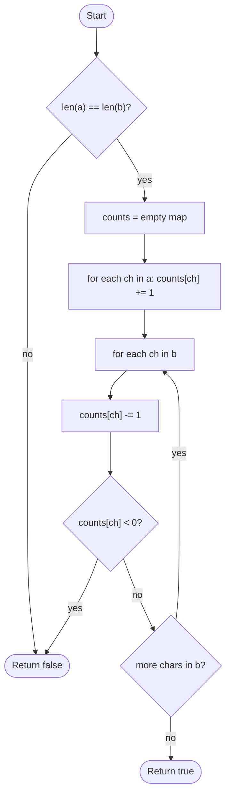

# Anagram Check

## Overview

Two strings are anagrams if one can be rearranged into the other: they contain exactly the same characters with the same multiplicities. Sorting both and comparing works but costs n log n. Counting is faster: tally each character of the first string in a hash map (or a fixed array when the alphabet is small), then subtract each character of the second string. If every count ends at zero, the multisets match. A length check up front rules out most non-anagrams instantly.

## How it works

1. If the two strings have different lengths they cannot be anagrams; return false.
2. Create an empty counter: a hash map from character to count, or an integer array indexed by character code for a fixed alphabet.
3. For each character in the first string, increment its count.
4. For each character in the second string, decrement its count. If a count would drop below zero, the second string has a character the first does not (or has more of it); return false.
5. After both passes every count is zero because the lengths are equal; return true.

## Flow

## Complexity

| Case    | Time | Why                                                            |
| ------- | ---- | -------------------------------------------------------------- |
| Best    | O(n) | Lengths equal: both strings are scanned once                    |
| Average | O(n) | Each character costs a constant-time map update                 |
| Worst   | O(n) | Same two passes; no sorting                                     |
| Space   | O(k) | One counter per distinct character, bounded by the alphabet size k |

## When to use

- Grouping words by their letters (group anagrams), using the sorted string or count signature as a hash key.
- Detecting permutation relationships in strings: "is one string a permutation of another".
- Sliding-window problems such as finding all anagram occurrences of a pattern in a text, where the counter is updated incrementally.
- Any multiset-equality check on sequences.

## Pitfalls

- Skipping the length check means a proper prefix can leave counts non-negative throughout and be wrongly accepted unless you also verify every count is zero at the end.
- Using a fixed 26-slot array assumes lowercase ASCII letters; uppercase, digits or Unicode input indexes out of range.
- Forgetting to normalise case or whitespace when the problem considers "Listen" and "Silent" anagrams.
- Checking only that both strings have the same set of characters ignores multiplicity ("aab" versus "abb").
- Sorting is simpler but O(n log n) and may allocate copies of both strings.
