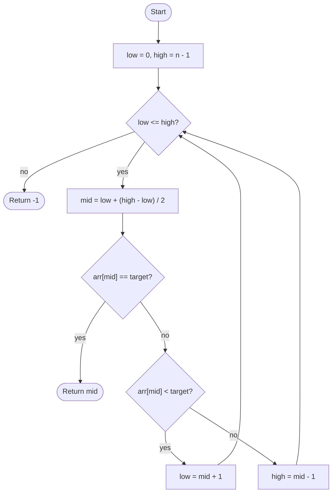

# Binary Search

## Overview

Binary search finds a target in a sorted array by repeatedly halving the range that could contain it. Compare the target to the middle element: if they match you are done; if the target is smaller it must be in the left half, otherwise in the right half. Each comparison throws away half of the remaining candidates, so even a billion elements need only about thirty steps.

## How it works

1. Set `low = 0` and `high = n - 1` to describe the inclusive range still under consideration.
2. If `low > high`, the range is empty and the target is absent; return `-1`.
3. Compute the middle index `mid = low + (high - low) / 2` using integer division.
4. If `arr[mid]` equals the target, return `mid`.
5. If `arr[mid]` is less than the target, the target can only be to the right: set `low = mid + 1`.
6. Otherwise the target can only be to the left: set `high = mid - 1`.
7. Go back to step 2.

## Flow

## Complexity

| Case    | Time     | Why                                                      |
| ------- | -------- | -------------------------------------------------------- |
| Best    | O(1)     | The target is exactly the first middle element            |
| Average | O(log n) | The range halves on every iteration                       |
| Worst   | O(log n) | Target absent or at an edge: about log2(n) + 1 iterations |
| Space   | O(1)     | Iterative version keeps only three indices                |

## When to use

- Lookups in a sorted array that is queried many times; the one-time sort cost is amortised over the queries.
- Finding the insertion point for a new value, or the first/last element satisfying a monotonic condition (lower bound / upper bound).
- "Binary search on the answer": any problem where a yes/no predicate is monotonic over a numeric range, such as the minimum capacity that ships all packages within d days.
- Searching a function's domain for a root or threshold when the function is monotonic.

## Pitfalls

- Computing `mid = (low + high) / 2` overflows in fixed-width integer languages when both indices are large; use `low + (high - low) / 2`.
- Using `low < high` with an inclusive `high` skips the case where the range has shrunk to a single element.
- Setting `low = mid` or `high = mid` instead of `mid + 1` / `mid - 1` can loop forever when the range has two elements.
- Mixing inclusive and exclusive conventions for `high` (`n - 1` versus `n`) leads to off-by-one errors; pick one and keep the loop condition consistent with it.
- Running it on unsorted data silently returns wrong answers rather than failing loudly.
- With duplicates, a plain binary search returns some matching index, not necessarily the first; use a lower-bound variant if that matters.
