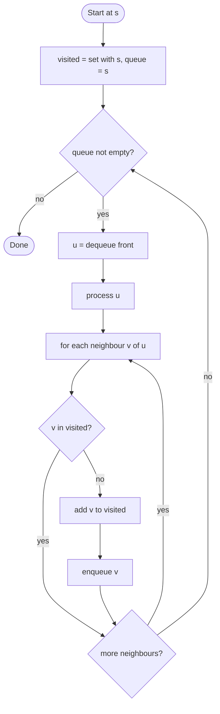

# Breadth-First Search

## Overview

Breadth-first search explores a graph outward from a starting vertex in layers: first every vertex one edge away, then every vertex two edges away, and so on. It does this with a queue. Each dequeued vertex has its unvisited neighbours marked and enqueued, so vertices are processed in order of their distance from the start. On an unweighted graph the first time BFS reaches a vertex is along a shortest path, which makes it the standard tool for shortest-path and "minimum number of moves" problems.

## How it works

1. Create an empty queue and a visited set. Mark the start vertex as visited and enqueue it.
2. While the queue is not empty, dequeue the front vertex `u` and process it (record it, check whether it is the goal, and so on).
3. For every neighbour `v` of `u`: if `v` has not been visited, mark it visited and enqueue it. Marking on enqueue, not on dequeue, prevents the same vertex from being queued many times.
4. To recover distances, store `dist[v] = dist[u] + 1` when `v` is first discovered; to recover paths, store `parent[v] = u`.
5. When the queue empties every vertex reachable from the start has been visited.

## Flow

## Complexity

| Case    | Time     | Why                                                          |
| ------- | -------- | ------------------------------------------------------------ |
| Best    | O(V + E) | Each vertex is enqueued once and each edge examined once      |
| Average | O(V + E) | The bound holds for any graph shape with an adjacency list    |
| Worst   | O(V + E) | Same; a dense graph makes E dominate                          |
| Space   | O(V)     | The visited set and the queue hold at most all vertices       |

## When to use

- Shortest path by number of edges in an unweighted graph, grid or state space (maze solving, word ladders, puzzle moves).
- Level-order traversal of a tree, or anything that must be processed layer by layer.
- Finding connected components, or testing whether a graph is bipartite via 2-colouring.
- Web crawlers and peer discovery, where nearby nodes should be reached before distant ones.
- Problems where the answer is "minimum number of steps" and every step has equal cost.

## Pitfalls

- Marking vertices visited when they are dequeued instead of when they are enqueued lets a vertex enter the queue many times, blowing up the running time.
- Using a stack by accident (or a dynamic array's pop from the end) turns BFS into DFS and loses the shortest-path guarantee.
- Popping from the front of a plain array is O(n); use a real queue or deque.
- BFS gives shortest paths only when all edges weigh the same; weighted graphs need Dijkstra.
- Forgetting the visited set on a graph with cycles loops forever; on a tree it is unnecessary only because there are no cycles.
- On an adjacency matrix the cost becomes O(V²) because every row is scanned fully.
