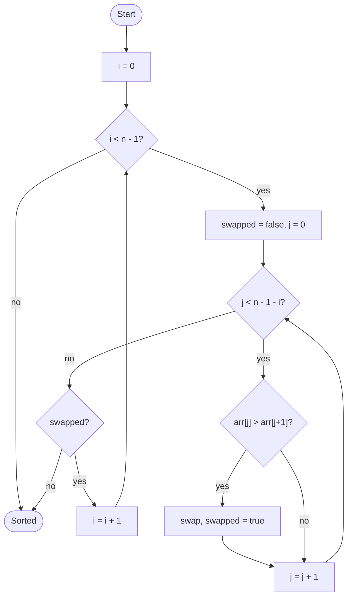

# Bubble Sort

## Overview

Bubble sort is the simplest comparison sort. It walks through the array again and again, comparing each pair of neighbours and swapping them when they are in the wrong order. After each full pass the largest remaining element has "bubbled up" to its final position at the end, so the next pass can stop one element earlier.

## How it works

1. Start at the beginning of the array.
2. Compare the current element with the next one. If the current element is larger, swap them.
3. Move one position to the right and repeat until the end of the unsorted region.
4. The largest element of that region is now at its end, so shrink the region by one.
5. If a full pass made no swaps the array is already sorted, so stop early.
6. Otherwise go back to step 1 for the smaller region.

## Flow

## Complexity

| Case    | Time  | Why                                               |
| ------- | ----- | ------------------------------------------------- |
| Best    | O(n)  | Already sorted: one pass, no swaps, early exit     |
| Average | O(n²) | About n²/4 swaps on random input                   |
| Worst   | O(n²) | Reverse-sorted: every pair is swapped              |
| Space   | O(1)  | Sorts in place with a single temporary for swaps   |

## When to use

- Teaching the idea of comparison sorting and the "swap neighbours" primitive.
- Tiny arrays where code size matters more than speed.
- Inputs that are already nearly sorted, where the early exit makes it linear.

## Pitfalls

- Forgetting to shrink the inner loop by `i` wastes comparisons on the already-sorted tail.
- Omitting the `swapped` flag loses the O(n) best case.
- Never use it for large inputs; insertion sort is faster with the same simplicity, and merge or quick sort are vastly faster.
