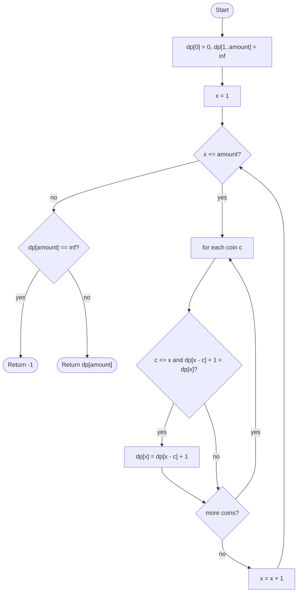

# Coin Change

## Overview

Given coin denominations and a target amount, find the fewest coins that sum exactly to the amount, with unlimited copies of each coin. Greedy choice (always take the largest coin) works for some currencies but fails in general, for example with coins 1, 3, 4 and amount 6. Bottom-up dynamic programming solves it: the fewest coins for amount `x` is one more than the fewest coins for `x - coin`, minimised over every coin that fits. Filling an array from 0 up to the amount answers every smaller subproblem before it is needed.

## How it works

1. Create an array `dp` of size `amount + 1`. Set `dp[0] = 0` (zero coins make zero) and every other entry to a sentinel meaning "unreachable", such as `amount + 1` or infinity.
2. For each amount `x` from 1 to `amount`:
3. For each coin `c` with `c <= x`: if `dp[x - c] + 1` is smaller than `dp[x]`, update `dp[x]`.
4. After both loops, `dp[amount]` is the minimum coin count, or still the sentinel if no combination reaches the amount.
5. Return `dp[amount]` if it is reachable, otherwise `-1`.
6. To list the coins used, also record which coin produced each `dp[x]` and walk backwards from `amount`.

## Flow

## Complexity

| Case    | Time        | Why                                                            |
| ------- | ----------- | -------------------------------------------------------------- |
| Best    | O(n·amount) | Every amount is combined with every one of the n coins          |
| Average | O(n·amount) | The loops do not depend on which coins succeed                  |
| Worst   | O(n·amount) | Same; no early exit even when the amount is unreachable         |
| Space   | O(amount)   | One entry per amount from 0 to the target                       |

## When to use

- Making change with the fewest coins or bills when denominations are arbitrary.
- Minimum number of steps where each step has a fixed set of sizes: jumps, stamps, package sizes.
- As the template for unbounded knapsack problems, where each item may be used any number of times.
- Counting the number of ways to make an amount is a close variant: swap `min` for a sum and loop coins outermost to avoid counting orderings twice.

## Pitfalls

- Using a greedy largest-coin strategy; it is wrong for most denomination sets.
- Initialising unreachable amounts to 0 instead of a sentinel makes every amount look free.
- Using a sentinel like the maximum integer and then adding 1 overflows; use `amount + 1` or a float infinity.
- Forgetting to check `c <= x` indexes `dp` with a negative value.
- Returning `dp[amount]` without checking it against the sentinel reports a bogus count for impossible amounts.
- For the counting variant, looping amounts outermost counts permutations rather than combinations.
