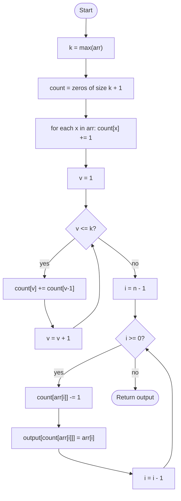

# Counting Sort

## Overview

Counting sort does not compare elements at all. It assumes the values are integers in a known, small range `0..k` and simply tallies how many times each value occurs. Converting those tallies into running totals tells you exactly where each value belongs in the output, so the sorted array can be filled in a single pass. This sidesteps the n log n lower bound for comparison sorts, at the cost of memory proportional to the range of values rather than the number of elements.

## How it works

1. Find the maximum value `k` in the input (or accept it as a parameter).
2. Create a count array of size `k + 1` filled with zeros.
3. For every element `x` in the input, increment `count[x]`.
4. Turn the counts into prefix sums: `count[v] = count[v] + count[v - 1]` for each `v` from 1 to `k`. Now `count[v]` is the number of elements less than or equal to `v`, which is one past the last output slot for value `v`.
5. Walk the input from right to left. For each element `x`, decrement `count[x]` and place `x` at `output[count[x]]`. Walking backwards keeps equal elements in their original order.
6. Return (or copy back) the output array.

## Flow

## Complexity

| Case    | Time     | Why                                                       |
| ------- | -------- | --------------------------------------------------------- |
| Best    | O(n + k) | One pass over the input plus one pass over the count array |
| Average | O(n + k) | Input order never matters                                  |
| Worst   | O(n + k) | Same passes; k dominates when the value range is large     |
| Space   | O(k)     | The count array; the output buffer adds O(n) if not in place |

## When to use

- Sorting integers (or anything mapped to small integers such as ages, grades, bytes) when the value range `k` is not much larger than `n`.
- As the stable inner sort of radix sort, which sorts large integers one digit at a time.
- Histogramming or bucketing tasks where the counts themselves are useful.

## Pitfalls

- Using it when `k` is huge (for example 32-bit integers) allocates an enormous count array and is far slower than a comparison sort.
- Negative values need an offset so they map to valid indices; naive implementations crash or silently drop them.
- Filling the output from left to right instead of right to left still sorts, but destroys stability, which breaks radix sort built on top of it.
- Allocating the count array of size `k` rather than `k + 1` misses the maximum value.
