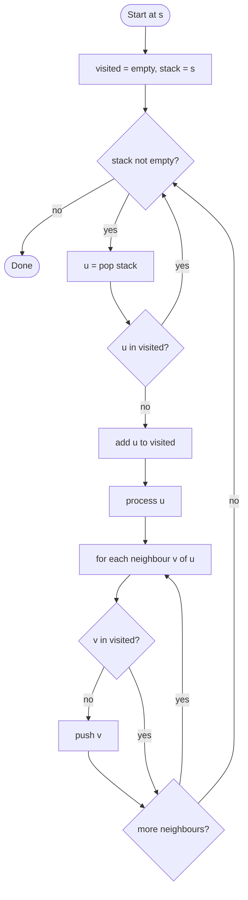

# Depth-First Search

## Overview

Depth-first search explores a graph by following one path as far as it can go before backing up and trying the next branch. From the current vertex it picks an unvisited neighbour, moves there, and repeats; only when a vertex has no unvisited neighbours does it backtrack. The natural implementation is recursive, with the call stack remembering where to resume, but an explicit stack gives the same order of exploration without recursion depth limits. DFS underpins cycle detection, topological ordering, connected components and many other graph algorithms.

## How it works

1. Keep a visited set so each vertex is expanded only once.
2. Mark the start vertex as visited and process it.
3. For each neighbour `v` of the current vertex: if `v` is not visited, recursively run DFS from `v`.
4. When all neighbours have been handled, return to the caller; this is the backtracking step.
5. Iterative form: push the start on a stack. Loop: pop a vertex; if already visited skip it; otherwise mark it, process it, and push all unvisited neighbours. The stack holds the frontier in the reverse order they will be explored.
6. To cover a disconnected graph, loop over all vertices and start a new DFS from any that is still unvisited.

## Flow

## Complexity

| Case    | Time     | Why                                                            |
| ------- | -------- | -------------------------------------------------------------- |
| Best    | O(V + E) | Every vertex is marked once and every edge is inspected once    |
| Average | O(V + E) | The bound is independent of the order neighbours are tried      |
| Worst   | O(V + E) | Same; with an adjacency matrix it degrades to O(V²)             |
| Space   | O(V)     | The visited set plus a stack or recursion depth up to V         |

## When to use

- Detecting cycles (a back edge to a vertex still on the current path means a cycle).
- Topological sorting of a DAG via reverse post-order, and finding strongly connected components.
- Enumerating paths, solving mazes, and backtracking searches such as puzzle solvers.
- Counting connected components or flood-filling regions in a grid.
- Tree problems where subtrees must be fully processed before their parent (computing subtree sizes, heights, DP on trees).

## Pitfalls

- Omitting the visited set on a graph with cycles recurses forever; it is only safe to skip on trees.
- In the iterative version, marking a vertex visited when it is pushed rather than popped changes the exploration order and can process vertices out of true DFS order.
- Recursion depth equals the longest path, so a long chain graph overflows the call stack; use the explicit-stack version for big inputs.
- DFS does not find shortest paths; the first path it finds can be arbitrarily long. Use BFS for that.
- For cycle detection in directed graphs, a single visited flag is not enough; you need to distinguish "in progress" from "finished" vertices.
- Forgetting the outer loop over all vertices misses components not reachable from the start.
