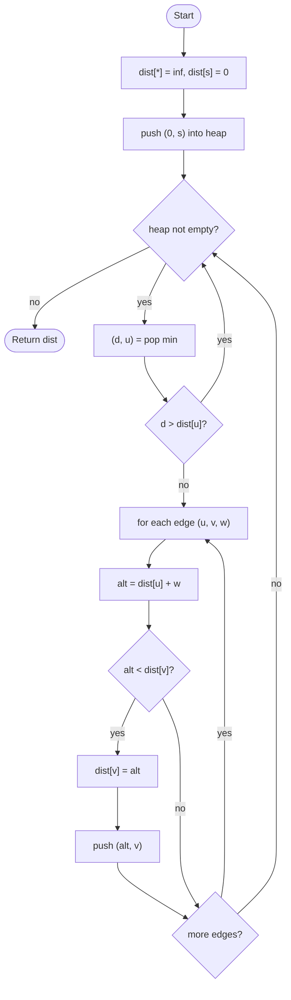

# Dijkstra's Algorithm

## Overview

Dijkstra's algorithm computes the shortest distance from a source vertex to every other vertex in a graph whose edge weights are non-negative. It is greedy: it always settles the unvisited vertex with the smallest known distance, because with non-negative weights no later path could make that distance smaller. A min-heap (priority queue) keyed by tentative distance supplies the next vertex to settle efficiently. When a shorter path to a neighbour is found, its distance is lowered and it is pushed into the heap again; this "relaxation" step is the core of the algorithm.

## How it works

1. Set `dist[v] = infinity` for every vertex and `dist[source] = 0`.
2. Push the pair `(0, source)` into a min-heap ordered by distance.
3. While the heap is not empty, pop the pair `(d, u)` with the smallest `d`.
4. If `d` is larger than `dist[u]`, this entry is stale (a better one was processed earlier); skip it.
5. For each edge `u -> v` with weight `w`: compute `alt = dist[u] + w`. If `alt < dist[v]`, set `dist[v] = alt`, record `parent[v] = u`, and push `(alt, v)` into the heap.
6. When the heap empties, `dist` holds the shortest distances and `parent` can be followed backwards to reconstruct each path.

## Flow

## Complexity

| Case    | Time             | Why                                                              |
| ------- | ---------------- | ---------------------------------------------------------------- |
| Best    | O((V + E) log V) | Every vertex is popped and every edge may push, each a log V heap op |
| Average | O((V + E) log V) | Lazy deletion keeps the heap at O(E) entries, log of which is O(log V) |
| Worst   | O((V + E) log V) | Same bound with a binary heap; a Fibonacci heap gives O(E + V log V) |
| Space   | O(V)             | Distance and parent arrays; the heap adds O(E) in the lazy version |

## When to use

- Single-source shortest paths on road networks, routing tables, and any weighted graph with non-negative weights.
- GPS navigation and network routing protocols (OSPF uses it directly).
- As the inner engine of A* when a heuristic is added, or of Johnson's algorithm for all-pairs paths.
- Finding the cheapest way to reach a goal state when each move has a different positive cost.

## Pitfalls

- Negative edge weights break the greedy argument; the algorithm silently returns wrong distances. Use Bellman-Ford instead.
- Forgetting the stale-entry check (`d > dist[u]`) still gives correct distances but re-relaxes edges unnecessarily and can blow up the running time.
- Using `infinity` as a large integer and then adding a weight to it can overflow; check for infinity before relaxing or use a floating-point infinity.
- Without a priority queue (scanning for the minimum each time) the running time becomes O(V²), which is acceptable only for dense graphs.
- Stopping as soon as the target is pushed, rather than when it is popped, can return a non-optimal distance.
- Heaps that compare whole tuples may compare vertex payloads when distances tie; make sure the vertex type is comparable or compare by distance only.
