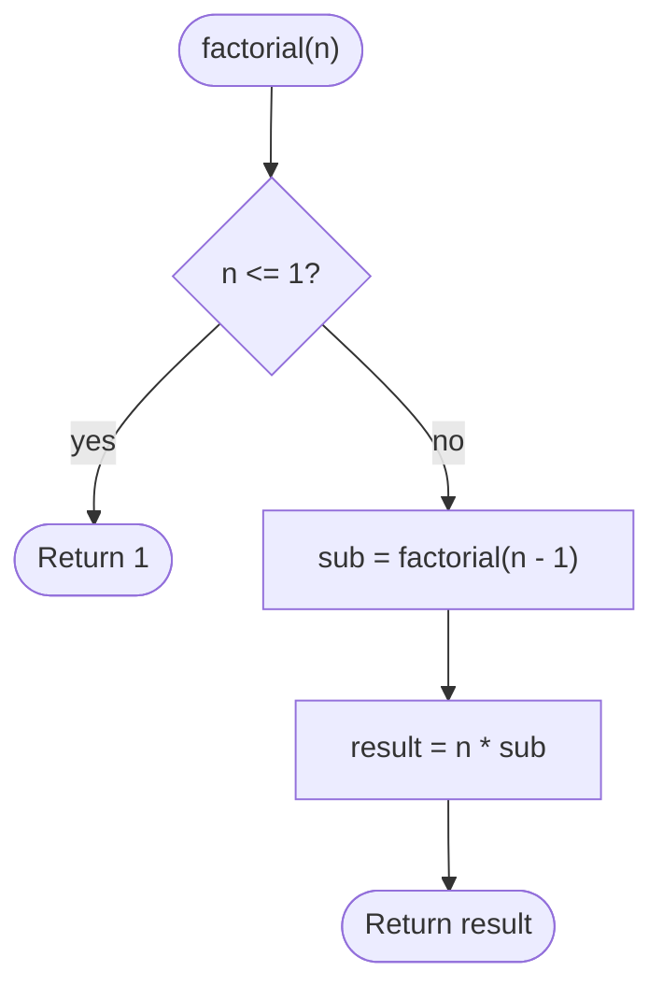

# Factorial

## Overview

The factorial of a non-negative integer n, written n!, is the product of every integer from 1 up to n, with 0! defined as 1. It counts the number of ways to arrange n distinct items in a row. The recursive definition n! = n * (n - 1)! maps directly onto a function that calls itself with a smaller argument until it reaches the base case, making it the classic first example of recursion.

## How it works

1. Receive a non-negative integer `n`.
2. Base case: if `n` is 0 or 1, return 1. Without this the recursion would never stop.
3. Recursive case: compute the factorial of `n - 1` by calling the function again.
4. Multiply that result by `n` and return it.
5. Each pending multiplication waits on the stack until the base case returns, then the products are combined on the way back up.

## Flow

## Complexity

| Case    | Time | Why                                                        |
| ------- | ---- | ---------------------------------------------------------- |
| Best    | O(n) | One call per decrement from n down to 1                     |
| Average | O(n) | The input fully determines the number of calls              |
| Worst   | O(n) | No branching; always exactly n multiplications              |
| Space   | O(n) | Each recursive call adds a frame to the call stack          |

## When to use

- Counting permutations, and as a building block for combinations (n choose k) and binomial coefficients.
- Teaching recursion: base case, recursive case, and how results combine during unwinding.
- Small n where the result fits in a native integer (up to 12 for 32-bit, 20 for 64-bit).

## Pitfalls

- Forgetting the base case, or writing it as `n == 1` only, makes `factorial(0)` recurse forever.
- Negative input has no factorial; validate it rather than recursing toward negative infinity.
- 21! already overflows a 64-bit integer. Use arbitrary-precision integers or floating point when larger values are needed.
- Deep recursion can overflow the call stack for large n; an iterative loop uses O(1) space and is preferable in production code.
- Recomputing factorials repeatedly inside a loop is wasteful; precompute a table or compute incrementally.
