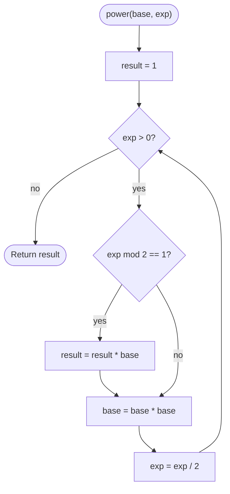

# Fast Exponentiation

## Overview

Raising a base to the power `exp` by multiplying `exp` times is linear in the exponent. Exponentiation by squaring uses the identity that `base^exp` is `(base^2)^(exp/2)` when `exp` is even, and `base * (base^2)^((exp-1)/2)` when it is odd. Halving the exponent on every step means only about log2(exp) multiplications are needed. The same loop works for modular arithmetic, matrices, or any associative operation, which is why it shows up in cryptography and in computing Fibonacci numbers in logarithmic time.

## How it works

1. Set `result = 1`.
2. While `exp` is greater than zero:
3. If `exp` is odd (its lowest bit is 1), multiply `result` by `base`.
4. Square `base` and halve `exp` using integer division (equivalently, shift `exp` right by one bit).
5. When `exp` reaches zero, `result` holds `base^exp`.
6. For modular exponentiation, reduce `result` and `base` modulo `m` after every multiplication so the numbers never grow large.

## Flow

## Complexity

| Case    | Time     | Why                                                              |
| ------- | -------- | ---------------------------------------------------------------- |
| Best    | O(log n) | The exponent is halved each iteration; n is the exponent          |
| Average | O(log n) | Each bit of the exponent costs one or two multiplications         |
| Worst   | O(log n) | An exponent of all 1 bits does two multiplications per bit        |
| Space   | O(1)     | Three variables; the iterative form has no recursion              |

## When to use

- Modular exponentiation in RSA, Diffie-Hellman, and primality tests (Miller-Rabin), where exponents have hundreds of bits.
- Computing large powers for combinatorics modulo a prime, including modular inverses via Fermat's little theorem.
- Matrix exponentiation to compute linear recurrences such as Fibonacci in O(log n).
- Any associative operation applied n times: string repetition, function composition, group operations.

## Pitfalls

- Multiplying without reducing modulo `m` at each step overflows even 64-bit integers after a few iterations.
- Even with reduction, `result * base` can overflow if `m` exceeds about 2^31 in a 64-bit language; use 128-bit intermediates or a multiply-mod routine.
- Negative exponents are not handled by the integer version; they need a reciprocal or a modular inverse.
- Forgetting to square `base` when the bit is zero (only doing it in the odd branch) produces wrong results.
- `0^0` is conventionally 1 in this algorithm because `result` starts at 1; make sure that matches the caller's expectation.
