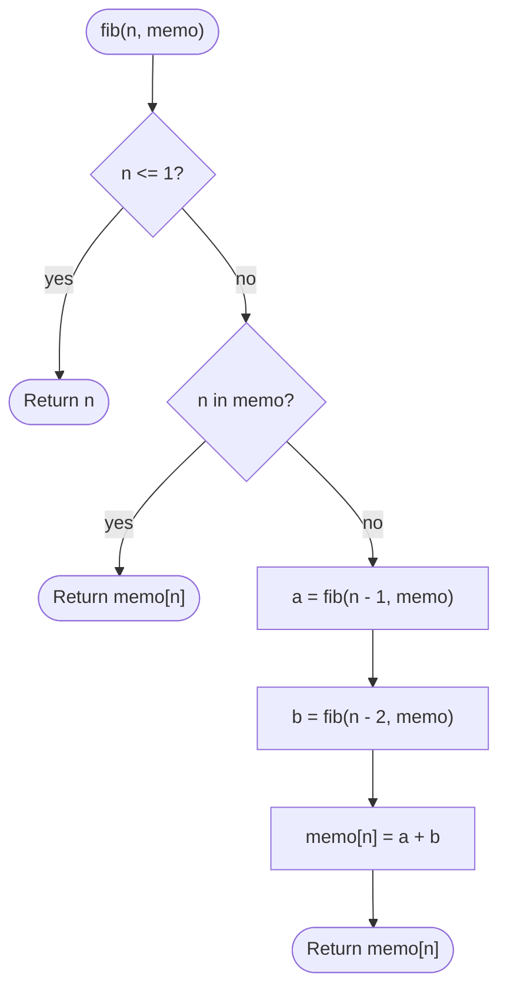

# Fibonacci (Memoized)

## Overview

The Fibonacci sequence starts 0, 1 and every later term is the sum of the two before it. The naive recursive definition `fib(n) = fib(n-1) + fib(n-2)` recomputes the same subproblems an exponential number of times. Memoization fixes this: the first time a value is computed it is stored in a hash map (or array) keyed by `n`, and every later request for the same `n` is answered from the cache. The tree of calls collapses into a chain of n distinct subproblems.

## How it works

1. Keep a memo table, typically a hash map from `n` to `fib(n)`, that persists across recursive calls.
2. Base case: if `n` is 0 or 1, return `n`.
3. If the memo already contains `n`, return the stored value immediately.
4. Otherwise compute `fib(n - 1)` and `fib(n - 2)` recursively; each of those will itself consult the memo.
5. Add the two results, store the sum in the memo under `n`, and return it.
6. Because each `n` is computed only once, the second recursive call almost always hits the cache.

## Flow

## Complexity

| Case    | Time | Why                                                             |
| ------- | ---- | --------------------------------------------------------------- |
| Best    | O(n) | Each value from 2 to n is computed exactly once                  |
| Average | O(n) | Cache hits are O(1); n distinct subproblems remain               |
| Worst   | O(n) | Even a cold cache costs one computation per subproblem           |
| Space   | O(n) | The memo holds n entries and the recursion reaches depth n       |

## When to use

- Any recursive function with overlapping subproblems where the top-down structure is easier to express than a bottom-up loop.
- Teaching the step from exponential recursion to dynamic programming.
- When only a few scattered values of `fib` are needed and the cache can be reused across calls.

## Pitfalls

- Omitting the memo turns the algorithm back into O(2^n); checking the cache after the base case but before recursing is essential.
- Creating a fresh memo inside each recursive call defeats the purpose; it must be shared (passed in or held in an enclosing scope).
- Recursion depth is still n, so very large n can overflow the call stack; an iterative two-variable loop uses O(1) space.
- Fibonacci numbers grow exponentially: fib(93) overflows a 64-bit integer. Use big integers or modular arithmetic when needed.
- A mutable default argument as the memo (a common shortcut in some languages) leaks state between unrelated callers.
