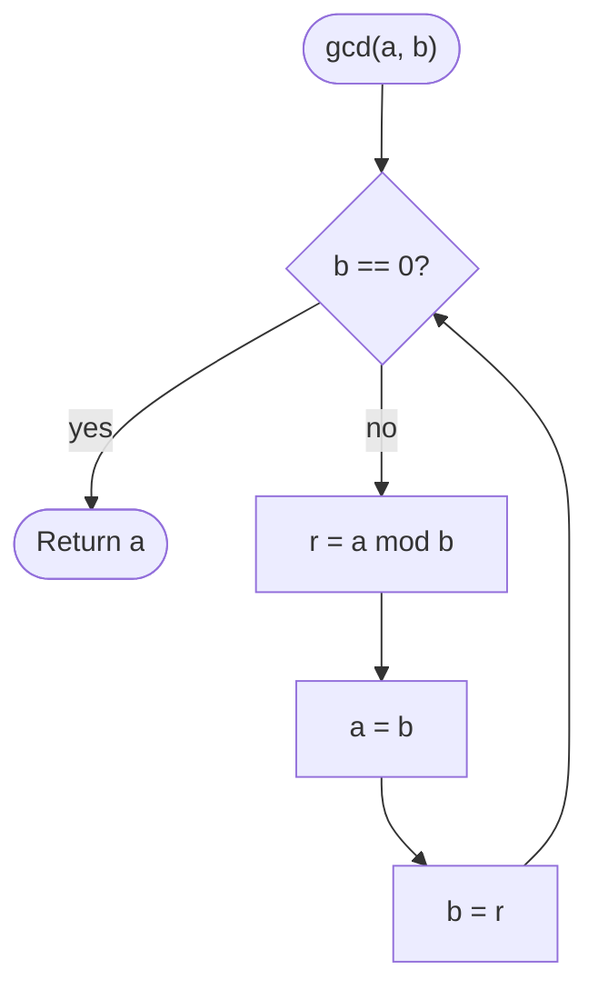

# GCD (Euclid)

## Overview

The greatest common divisor of two integers is the largest integer that divides both without remainder. Euclid's algorithm, over two thousand years old, rests on one observation: any divisor common to `a` and `b` also divides `a mod b`, so `gcd(a, b) = gcd(b, a mod b)`. Repeatedly replacing the pair with the smaller number and the remainder shrinks the numbers very quickly until the remainder hits zero, at which point the other number is the answer.

## How it works

1. Take two non-negative integers `a` and `b`.
2. If `b` is zero, `a` is the GCD; return it.
3. Otherwise compute the remainder `r = a mod b`.
4. Replace `a` with `b` and `b` with `r`.
5. Go back to step 2. Each round at least halves the larger number every two steps, so the loop ends quickly.

## Flow

## Complexity

| Case    | Time             | Why                                                          |
| ------- | ---------------- | ------------------------------------------------------------ |
| Best    | O(1)             | b divides a on the first step (for example b = 0 or b = 1)    |
| Average | O(log min(a, b)) | The remainder shrinks geometrically in the smaller argument   |
| Worst   | O(log min(a, b)) | Consecutive Fibonacci numbers force the most steps            |
| Space   | O(1)             | Two integers are updated in place                             |

## When to use

- Reducing fractions to lowest terms.
- Computing the least common multiple via `lcm(a, b) = a / gcd(a, b) * b`.
- Checking whether two numbers are coprime, which underlies modular inverses and RSA key generation.
- The extended version also yields coefficients `x, y` with `a*x + b*y = gcd(a, b)`, used for solving linear congruences.

## Pitfalls

- Swapping the assignments (`b = r` before `a = b`) loses the old value of `b`; use a temporary or simultaneous assignment.
- Using subtraction instead of the remainder is correct but can take O(max(a, b)) steps when one number is tiny.
- Negative inputs: the remainder operator's sign differs between languages, so take absolute values first.
- `gcd(0, 0)` is conventionally 0; make sure the base case does not divide by zero.
- Computing `a * b / gcd` for the LCM can overflow; divide before multiplying.
