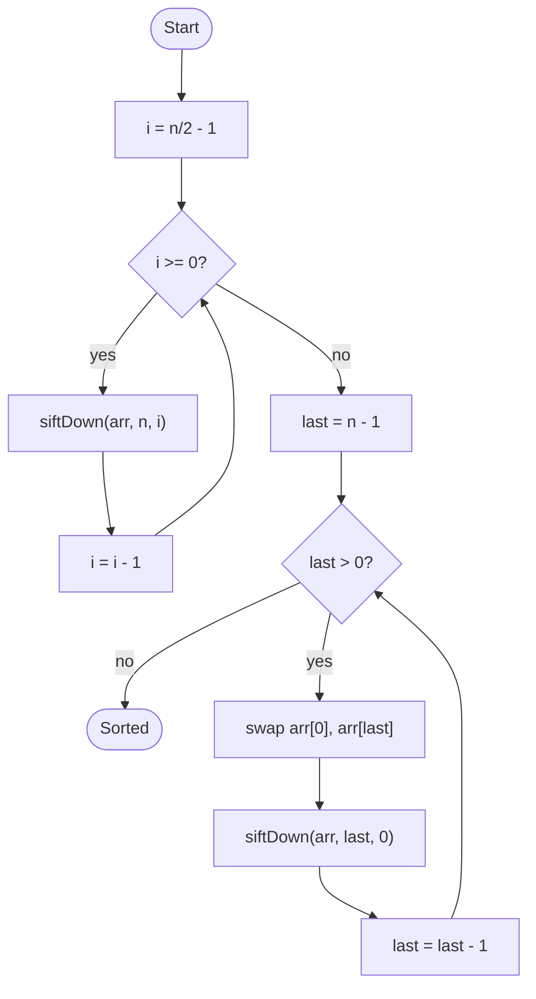

# Heap Sort

## Overview

Heap sort improves on selection sort by using a binary max-heap to find the largest remaining element in logarithmic rather than linear time. The array itself is reorganised into a heap, where each parent is at least as large as its children and the root holds the maximum. The root is repeatedly swapped to the end of the unsorted region and the heap is repaired, so the sorted part grows from the back while the heap shrinks from the front.

## How it works

1. View the array as a complete binary tree: the children of index `i` are `2i + 1` and `2i + 2`.
2. Build a max-heap by calling `siftDown` on every non-leaf index from `n / 2 - 1` down to `0`. `siftDown` compares a node with its children and swaps it with the larger child until it is no smaller than both.
3. Now `arr[0]` is the maximum. Swap it with the last element of the heap region, which puts the maximum in its final sorted place.
4. Shrink the heap region by one and call `siftDown` on the root to restore the heap property.
5. Repeat steps 3 and 4 until the heap region has one element left. The array is sorted in ascending order.

## Flow

## Complexity

| Case    | Time       | Why                                                          |
| ------- | ---------- | ------------------------------------------------------------ |
| Best    | O(n log n) | n extractions, each costing a log n sift                      |
| Average | O(n log n) | Same work regardless of input order                           |
| Worst   | O(n log n) | Guaranteed; heap operations never degrade                     |
| Space   | O(1)       | The heap lives inside the input array                         |

## When to use

- When you need a guaranteed O(n log n) sort without the O(n) extra memory of merge sort.
- Embedded or memory-constrained environments.
- When you only need the k largest or smallest elements: build the heap in O(n) and extract k times.
- As the fallback in introsort when quick sort's recursion gets too deep.

## Pitfalls

- Building the heap by sifting up each element one at a time is O(n log n); sifting down from the last parent is O(n).
- Off-by-one in the child formulas (`2i` instead of `2i + 1` with zero-based indexing) silently corrupts the heap.
- `siftDown` must respect the shrinking heap size, not the full array length, or sorted elements at the end get pulled back in.
- Heap sort is not stable, and its poor cache locality makes it slower than quick sort in practice despite the same asymptotic bound.
