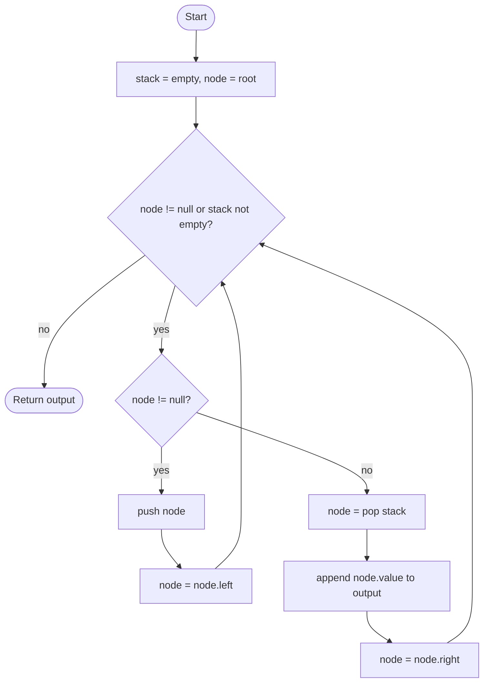

# Inorder Traversal

## Overview

Inorder traversal visits the nodes of a binary tree in the order left subtree, then the node itself, then right subtree. On a binary search tree this produces the keys in ascending sorted order, which is why it is the most frequently used of the three depth-first orders. The recursive definition is direct: traverse the left child, process the current node, traverse the right child. An iterative version replaces the call stack with an explicit stack of nodes whose left side has been pushed but not yet processed.

## How it works

1. If the current node is null, there is nothing to do; return.
2. Recursively traverse the left subtree.
3. Visit the current node: append its value to the output, print it, or apply the callback.
4. Recursively traverse the right subtree.
5. Iterative form: start with an empty stack and `node = root`. Walk left, pushing every node, until `node` is null. Pop a node, visit it, then set `node` to its right child and repeat. Stop when both the stack is empty and `node` is null.

## Flow

## Complexity

| Case    | Time | Why                                                                   |
| ------- | ---- | --------------------------------------------------------------------- |
| Best    | O(n) | Every node is pushed, popped and visited exactly once                  |
| Average | O(n) | Tree shape changes only the stack depth, not the number of visits      |
| Worst   | O(n) | Same; a skewed tree still visits each node once                        |
| Space   | O(h) | The stack (or recursion) holds one path, at most the tree height h     |

## When to use

- Reading a binary search tree in sorted order, or validating that it is a BST (each value must exceed the previous one).
- Finding the k-th smallest element in a BST: stop after k visits.
- Converting a BST to a sorted array or sorted doubly linked list.
- Any tree processing where a node's left context must be finished before the node is handled, such as printing infix expressions from expression trees.

## Pitfalls

- Visiting the node before the left subtree gives preorder, not inorder; the order of the three lines matters.
- The iterative loop condition must check both the stack and the current node; checking only the stack stops too early on the very first iteration.
- On a degenerate (linked-list shaped) tree the height is n, so the recursive version can overflow the call stack for large inputs.
- Validating a BST by comparing each node only with its direct children is wrong; inorder with a running "previous" value is the correct check.
- Morris traversal achieves O(1) space but temporarily mutates the tree; do not use it on shared or immutable structures.
