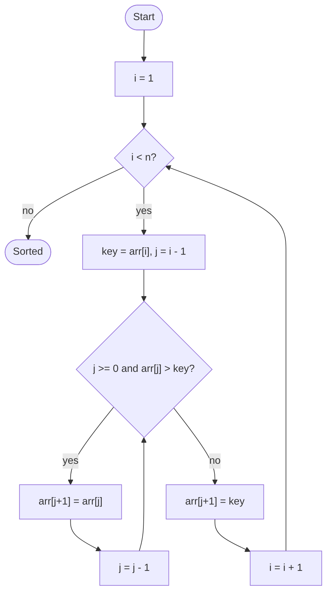

# Insertion Sort

## Overview

Insertion sort works the way most people sort a hand of playing cards. It keeps a sorted prefix at the front of the array and takes the next unsorted element, called the key, then slides it leftward past every larger element until it lands in its correct spot. Because each element only moves as far as it needs to, nearly sorted input is handled in close to linear time.

## How it works

1. Consider the first element to be a sorted prefix of length one.
2. Take the element at position `i` (starting with `i = 1`) and save it as `key`.
3. Set `j = i - 1`. While `j >= 0` and `arr[j] > key`, copy `arr[j]` one slot to the right and decrement `j`.
4. When the loop stops, position `j + 1` is the first slot whose left neighbour is not larger than `key`. Write `key` there.
5. Increment `i` and repeat from step 2 until every element has been inserted.

## Flow

## Complexity

| Case    | Time  | Why                                                            |
| ------- | ----- | -------------------------------------------------------------- |
| Best    | O(n)  | Sorted input: each key stops after one comparison               |
| Average | O(n²) | Each key shifts about half of the sorted prefix on average      |
| Worst   | O(n²) | Reverse-sorted input: every key travels to the very front       |
| Space   | O(1)  | Shifts happen in place; only the key is held aside              |

## When to use

- Small arrays (a few dozen elements), where it beats merge and quick sort thanks to low constant overhead; many library sorts switch to it for small partitions.
- Nearly sorted data, where the running time is close to linear.
- Online scenarios where elements arrive one at a time and the collection must stay sorted after each arrival.
- When a stable sort is required and the input is small.

## Pitfalls

- Checking `arr[j] > key` before `j >= 0` reads out of bounds when the key belongs at the front; the bounds test must come first.
- Using `arr[j] >= key` instead of `arr[j] > key` still sorts correctly but breaks stability by moving equal elements past each other.
- Writing the key to `arr[j]` instead of `arr[j + 1]` after the loop overwrites the wrong slot.
- Swapping on every step instead of shifting works, but roughly triples the number of writes.
