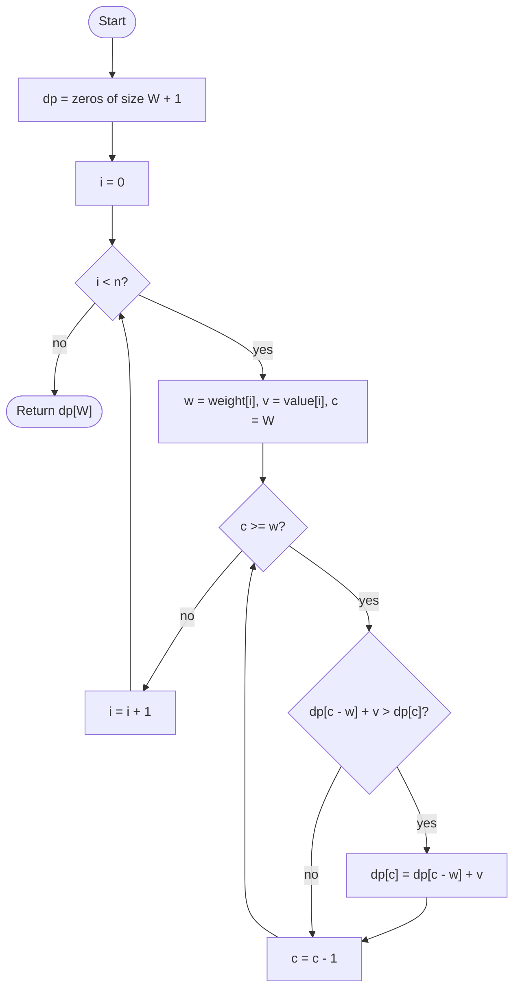

# 0/1 Knapsack

## Overview

You have `n` items, each with a weight and a value, and a bag that can carry at most `W` units of weight. Each item is either taken whole or left behind (hence 0/1), and the goal is the maximum total value that fits. Greedy choices fail here, but dynamic programming works: the best value achievable with the first `i` items and capacity `c` depends only on the best values with the first `i - 1` items. A one-dimensional array indexed by capacity suffices if it is updated from high capacity to low, so that each item is counted at most once.

## How it works

1. Create an array `dp` of size `W + 1` filled with zeros. `dp[c]` will hold the best value achievable with capacity `c` using the items considered so far.
2. For each item with weight `w` and value `v`:
3. Loop the capacity `c` downward from `W` to `w`.
4. Set `dp[c] = max(dp[c], dp[c - w] + v)`: either skip the item (keep `dp[c]`) or take it (the best value at the remaining capacity plus this item's value).
5. Iterating downward is essential: `dp[c - w]` must still refer to the previous item's row, not an already-updated value that includes the current item.
6. After all items, `dp[W]` is the answer. To know which items were taken, keep the full 2D table or a separate choice record.

## Flow

## Complexity

| Case    | Time   | Why                                                              |
| ------- | ------ | ---------------------------------------------------------------- |
| Best    | O(n·W) | Every item is combined with every capacity from w to W            |
| Average | O(n·W) | The loops are fixed regardless of the item values                 |
| Worst   | O(n·W) | Pseudo-polynomial: W is a number, so this is exponential in its bit length |
| Space   | O(W)   | A single capacity-indexed array, reused for every item            |

## When to use

- Budgeted selection problems: choosing projects under a cost cap, cargo loading, cutting stock.
- Subset-sum and partition problems, which are the special case where value equals weight.
- Any problem where each option is taken at most once and the constraint is a smallish integer.
- When `W` is moderate (up to a few million); for huge capacities with few items, meet-in-the-middle or branch and bound are better.

## Pitfalls

- Iterating the capacity loop upward instead of downward lets an item be used multiple times, which solves the unbounded knapsack instead.
- Starting the inner loop at `c = 0` and indexing `dp[c - w]` with a negative index either crashes or reads garbage; start at `c = w`.
- Allocating `dp` of size `W` rather than `W + 1` loses the full-capacity answer.
- Fractional weights or values require scaling to integers first; floating-point capacities cannot index an array.
- The 1D array does not record which items were chosen; keep the 2D table if the subset itself is needed.
- Very large `W` makes the algorithm impractical even though it is polynomial in `n`.
