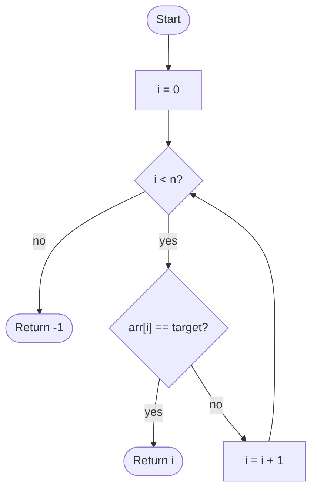

# Linear Search

## Overview

Linear search is the most basic way to find something in a collection: look at every element in turn and stop as soon as you see the one you want. It makes no assumptions about the data, so it works on unsorted arrays, linked lists, streams, or anything you can iterate once. The price is that in the worst case you examine every element.

## How it works

1. Start at index `i = 0`.
2. If `i` has reached the end of the array, the target is absent; return `-1` (or an equivalent "not found" value).
3. Compare `arr[i]` with the target. If they are equal, return `i`.
4. Otherwise increment `i` and go back to step 2.

## Flow

## Complexity

| Case    | Time | Why                                                   |
| ------- | ---- | ----------------------------------------------------- |
| Best    | O(1) | The target is the first element                        |
| Average | O(n) | About n/2 elements are examined on a random hit        |
| Worst   | O(n) | The target is last or absent, so every element is read |
| Space   | O(1) | Only the loop index is stored                          |

## When to use

- Unsorted data, where no faster search is possible without preprocessing.
- Very small collections, where the overhead of hashing or sorting is not worth it.
- Single, one-off lookups: sorting first costs O(n log n), more than one linear scan.
- Data structures without random access, such as linked lists or input streams.
- Searching by a predicate rather than an exact key (first element greater than x, first string containing a substring).

## Pitfalls

- Returning the element instead of its index loses information when the caller needs the position, and makes "not found" ambiguous for falsy values.
- Using `i <= n` as the loop bound reads past the end of the array.
- Continuing to scan after a match wastes time when only the first occurrence is needed; conversely, returning early is a bug when all occurrences are wanted.
- Reaching for linear search on large sorted data when binary search would be exponentially faster.
