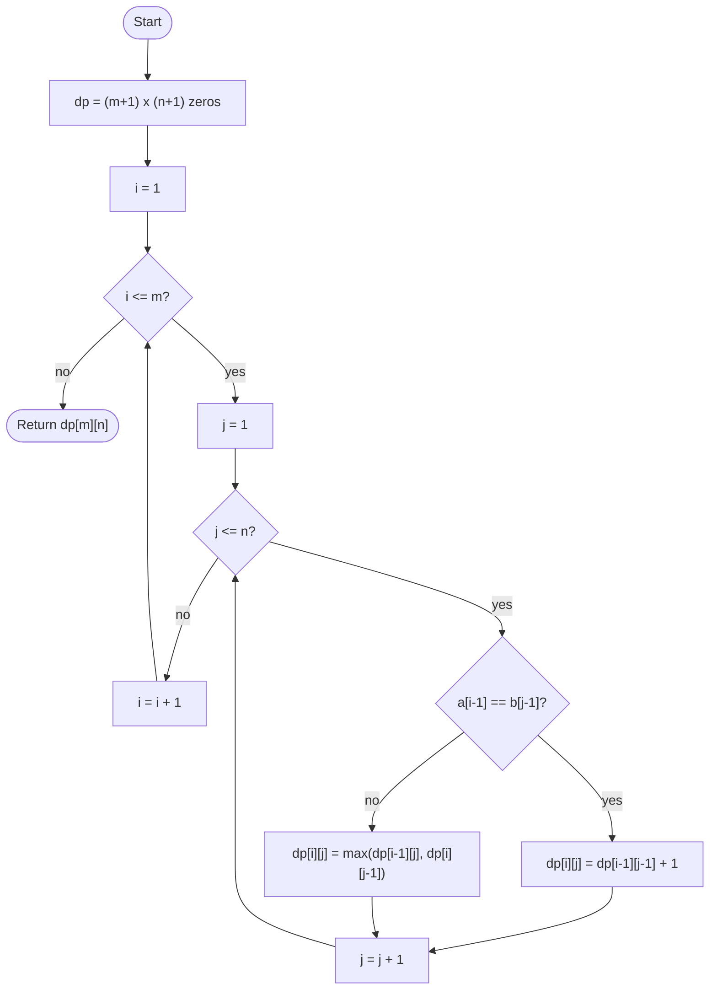

# Longest Common Subsequence

## Overview

A subsequence is what remains of a string after deleting zero or more characters without reordering the rest. The longest common subsequence problem asks for the longest string that is a subsequence of both inputs. Trying every subsequence is exponential, but the problem has optimal substructure: the LCS of two prefixes depends only on the LCS of slightly shorter prefixes. A two-dimensional table `dp[i][j]` holding the LCS length of the first `i` characters of `a` and the first `j` characters of `b` can be filled row by row in m times n steps.

## How it works

1. Let `m` and `n` be the lengths of strings `a` and `b`. Create a table `dp` with `m + 1` rows and `n + 1` columns, initialised to zero. Row 0 and column 0 represent empty prefixes, whose LCS with anything is empty.
2. For each `i` from 1 to `m` and each `j` from 1 to `n`:
3. If `a[i-1]` equals `b[j-1]`, that character can extend the best match of the two shorter prefixes: `dp[i][j] = dp[i-1][j-1] + 1`.
4. Otherwise one of the two last characters must be dropped: `dp[i][j] = max(dp[i-1][j], dp[i][j-1])`.
5. When the table is full, `dp[m][n]` is the LCS length.
6. To recover the subsequence itself, walk back from `dp[m][n]`: on a match move diagonally and record the character; otherwise move toward whichever neighbour holds the larger value.

## Flow

## Complexity

| Case    | Time   | Why                                                           |
| ------- | ------ | ------------------------------------------------------------- |
| Best    | O(m·n) | Every table cell is computed once, even for identical strings  |
| Average | O(m·n) | Each cell takes constant time from its three neighbours        |
| Worst   | O(m·n) | No early exit; the full table is always filled                 |
| Space   | O(m·n) | The full table is needed to reconstruct the subsequence        |

## When to use

- Diff tools: the lines not in the LCS of two files are exactly the insertions and deletions.
- Version control merges and plagiarism or similarity detection.
- Bioinformatics, for aligning DNA or protein sequences (edit distance and alignment are close relatives).
- Any problem phrased as "longest subsequence shared by two sequences", including longest palindromic subsequence (LCS of a string with its reverse).

## Pitfalls

- Indexing the strings with `i` and `j` instead of `i - 1` and `j - 1` compares the wrong characters, because the table has an extra leading row and column.
- Confusing subsequence with substring: substrings must be contiguous and use a different recurrence that resets to zero on a mismatch.
- Taking `dp[i-1][j-1] + 1` even on a mismatch overcounts.
- If only the length is required, two rolling rows cut memory to O(min(m, n)), but then the subsequence itself cannot be reconstructed without Hirschberg's technique.
- The LCS is not unique; tests should check length and validity rather than one specific answer.
