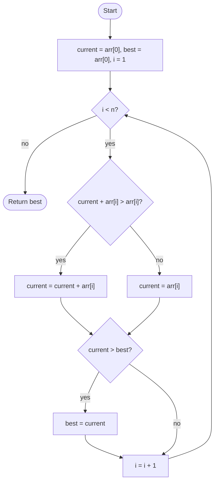

# Max Subarray (Kadane)

## Overview

Given an array of numbers, possibly negative, find the contiguous slice with the largest sum. Kadane's algorithm scans once while tracking the best sum of a subarray that ends at the current position. The insight is that a subarray ending here is either the previous best-ending-here subarray extended by one element, or a fresh start at this element alone, whichever is larger. If the running sum ever goes negative it can only hurt, so starting over is better. The global answer is the maximum of these local bests.

## How it works

1. Set `currentSum` and `bestSum` to the first element. Starting from the first element rather than zero makes all-negative arrays return the largest (least negative) element.
2. For each subsequent element `x`:
3. Set `currentSum = max(x, currentSum + x)`: extend the running subarray or restart at `x`.
4. Set `bestSum = max(bestSum, currentSum)`.
5. After the loop, `bestSum` is the maximum subarray sum.
6. To recover the subarray bounds, record the index where `currentSum` restarts and the index where `bestSum` is last improved.

## Flow

## Complexity

| Case    | Time | Why                                                          |
| ------- | ---- | ------------------------------------------------------------ |
| Best    | O(n) | Every element is visited once; no early exit is possible      |
| Average | O(n) | Two comparisons per element                                   |
| Worst   | O(n) | Same single pass regardless of signs                          |
| Space   | O(1) | Two running values (plus indices if the bounds are needed)    |

## When to use

- Maximum profit from a single buy/sell on a price series (apply Kadane to the day-to-day differences).
- Signal processing and bioinformatics: finding the most "positive" stretch of a scored sequence.
- Any 1D optimisation that asks for the best contiguous window with additive scores.
- Extended to 2D (maximum-sum submatrix) by fixing a pair of rows and running Kadane over column sums.
- As the archetype of "DP with O(1) state": the answer for position i depends only on position i - 1.

## Pitfalls

- Initialising `best` to 0 returns 0 for all-negative input instead of the largest element; initialise from the first element or to negative infinity.
- Resetting `current` to 0 when it goes negative is a common variant that also fails for all-negative arrays unless `best` is handled separately.
- Updating `best` before `current` uses a stale running sum and misses the last element's contribution.
- Tracking subarray bounds needs care: the start index must be recorded at the moment of a restart, not when `best` improves.
- An empty-subarray convention (answer 0 allowed) changes the initialisation; be explicit about which definition is used.
