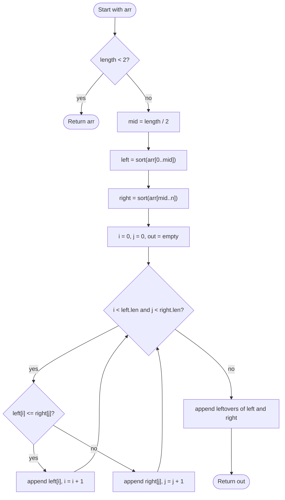

# Merge Sort

## Overview

Merge sort is a divide-and-conquer sort. It splits the array into two halves, sorts each half recursively, and then merges the two sorted halves into one sorted sequence. Merging two sorted lists is a simple linear operation, and because the array is halved at every level there are only about log n levels, giving a guaranteed n log n running time no matter how the input is arranged.

## How it works

1. If the array has fewer than two elements it is already sorted; return it.
2. Find the middle index and split the array into a left half and a right half.
3. Recursively sort the left half, then recursively sort the right half.
4. Merge: keep one cursor in each half. Compare the elements under the cursors, copy the smaller one into the output and advance that cursor. On ties, take from the left half to keep the sort stable.
5. When one half is exhausted, copy the remainder of the other half straight to the output.
6. The merged output replaces the original range; return it to the caller.

## Flow

## Complexity

| Case    | Time       | Why                                                           |
| ------- | ---------- | ------------------------------------------------------------- |
| Best    | O(n log n) | Always splits into halves; merging a level costs O(n)          |
| Average | O(n log n) | Input order does not change the split or merge work            |
| Worst   | O(n log n) | Guaranteed; there is no bad pivot or degenerate case           |
| Space   | O(n)       | The merge step needs a temporary buffer the size of the input  |

## When to use

- When a guaranteed O(n log n) worst case matters, for example in latency-sensitive code where quick sort's quadratic worst case is unacceptable.
- When stability is required (sorting records by one key while preserving the order of another).
- Sorting linked lists, where merging needs no extra array and the lack of random access does not hurt.
- External sorting of data larger than memory, since merging works on sequential streams.

## Pitfalls

- Computing `mid` as `(low + high) / 2` can overflow in fixed-width integers; use `low + (high - low) / 2`.
- Using `<` instead of `<=` when comparing the heads during the merge breaks stability by preferring the right half on ties.
- Forgetting to copy the leftover tail of whichever half was not exhausted drops elements.
- Allocating a fresh buffer at every recursion level is correct but slow; a single shared buffer is the usual optimisation.
- Recursing until a single element is wasteful; switching to insertion sort for small ranges is a common speedup.
