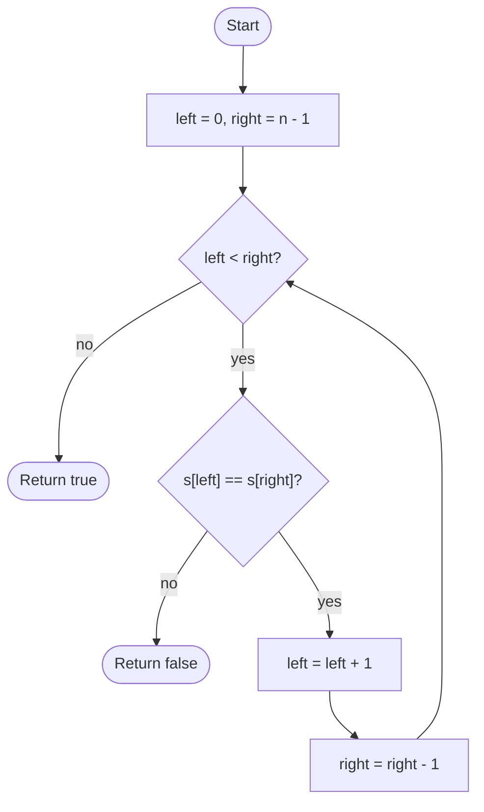

# Palindrome Check

## Overview

A palindrome reads the same forwards and backwards, like "racecar" or "level". The two-pointer check places one index at each end of the string and walks them toward the middle, comparing the characters they point at. The first mismatch proves the string is not a palindrome; if the pointers meet or cross without a mismatch, it is. This avoids building a reversed copy and stops as early as possible.

## How it works

1. Optionally normalise the input: lowercase it and drop characters that should be ignored (spaces, punctuation), depending on the problem's definition.
2. Set `left = 0` and `right = n - 1`.
3. While `left < right`:
4. If the character at `left` differs from the character at `right`, return false immediately.
5. Otherwise move `left` one step right and `right` one step left.
6. When the pointers meet (odd length) or cross (even length), every pair has matched; return true.

## Flow

## Complexity

| Case    | Time | Why                                                        |
| ------- | ---- | ---------------------------------------------------------- |
| Best    | O(1) | The first and last characters already differ                |
| Average | O(n) | Random palindromes need all n/2 comparisons to confirm      |
| Worst   | O(n) | A true palindrome requires checking every pair              |
| Space   | O(1) | Two indices; no reversed copy is built                      |

## When to use

- Validating palindromic words, numbers or sequences without allocating a reversed copy.
- As the inner check in "longest palindromic substring" (expand around centre uses the same inward/outward comparison).
- Checking whether a linked list is a palindrome, after reversing its second half in place.
- Problems that allow one deletion: on the first mismatch, try skipping either side and run the check on the remainder.

## Pitfalls

- Using `left <= right` is harmless but wastes one self-comparison; using `left < right - 1` skips the middle pair on even-length strings.
- Comparing bytes on multi-byte encodings splits characters apart; iterate over code points or grapheme clusters if the input is not ASCII.
- Forgetting to normalise case or strip non-alphanumeric characters when the problem calls for it ("A man, a plan...").
- Building the reversed string and comparing is correct but uses O(n) extra space and cannot exit early.
- The empty string and single characters are palindromes; make sure the loop condition handles `n = 0` without indexing.
