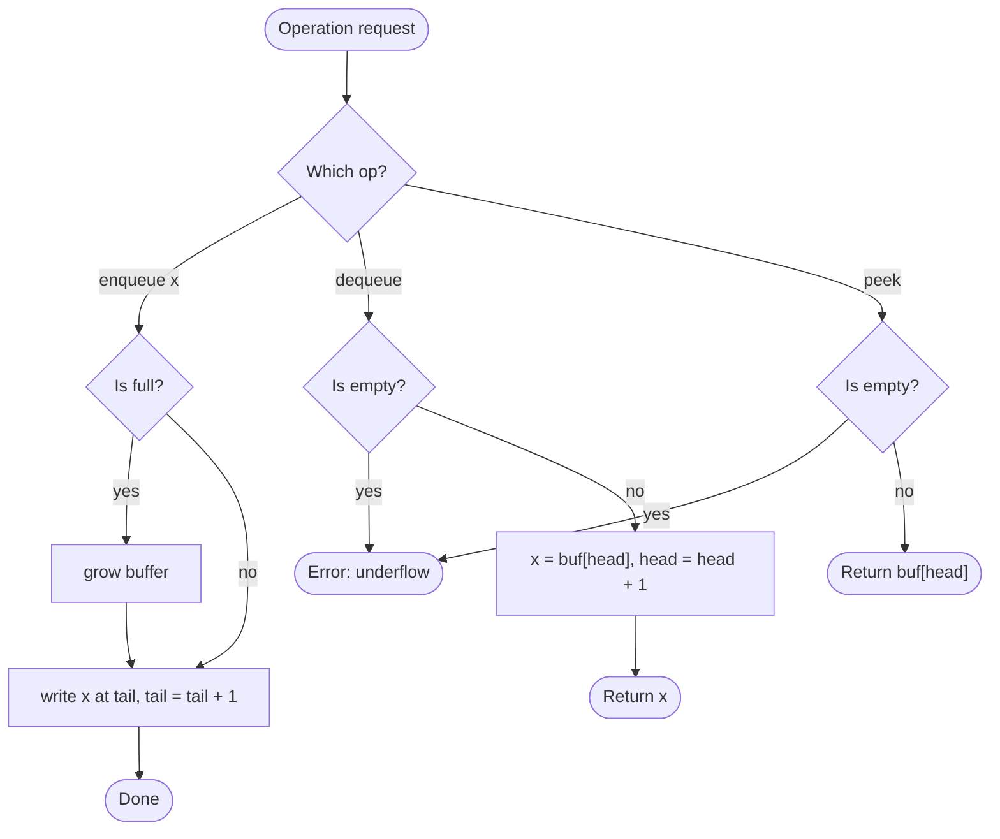

# Queue

## Overview

A queue is a collection where elements leave in the same order they arrived: first in, first out, like a line at a shop. Enqueue adds to the back, dequeue removes from the front, and peek inspects the front. A naive array implementation makes dequeue linear because every remaining element shifts forward, so real queues use a doubly ended deque, a linked list with head and tail pointers, or a ring buffer with wrapping head and tail indices to keep every operation constant time.

## How it works

1. Keep a buffer plus two positions: `head` (where the next dequeue reads) and `tail` (where the next enqueue writes).
2. Enqueue: if using a fixed ring buffer and it is full, grow it or reject the element. Otherwise write the element at `tail` and advance `tail` (wrapping around to 0 in a ring buffer).
3. Dequeue: if `head == tail` the queue is empty; signal an error. Otherwise read the element at `head`, advance `head`, and return it.
4. Peek: return the element at `head` without advancing, after the same empty check.
5. Size is `tail - head` (modulo the capacity for a ring buffer).

## Flow

## Complexity

| Case    | Time | Why                                                              |
| ------- | ---- | ---------------------------------------------------------------- |
| Best    | O(1) | Enqueue and dequeue each move one index                           |
| Average | O(1) | Ring-buffer growth is amortised over many operations              |
| Worst   | O(1) | Amortised; an occasional resize copies all elements               |
| Space   | O(n) | Holds every element not yet dequeued                              |

## When to use

- Breadth-first search and any level-by-level processing of trees or graphs.
- Task scheduling, job queues and message passing between producers and consumers.
- Buffering streams of data (keyboard input, network packets) where order must be preserved.
- Simulations that model waiting lines or round-robin scheduling.
- Sliding-window problems, often with a deque that also allows removal from the back.

## Pitfalls

- Dequeuing by removing the first element of a plain array is O(n); use a deque, linked list or head index instead.
- Forgetting to wrap the indices in a ring buffer writes past the end of the storage.
- Using `head == tail` for both "empty" and "full" in a ring buffer is ambiguous; keep a count or leave one slot unused.
- Mixing up queue and stack semantics turns BFS into DFS.
- Letting `head` advance forever without reclaiming space in an array-backed queue leaks memory.
