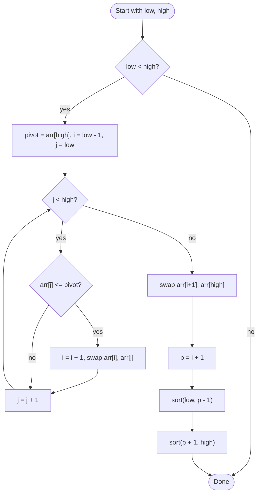

# Quick Sort

## Overview

Quick sort picks one element as a pivot and partitions the rest of the range so that everything smaller than the pivot is on its left and everything larger is on its right. The pivot is then in its final position, and the two sides are sorted recursively. Unlike merge sort it does the real work before recursing and needs no extra buffer, which makes it very fast in practice, but a poorly chosen pivot can degrade it to quadratic time.

## How it works

1. If the range `low..high` has fewer than two elements, it is sorted; return.
2. Choose a pivot. The simplest choice is the last element; a random element or the median of first, middle and last is more robust.
3. Partition: keep a boundary index `i` starting just before `low`. Scan `j` from `low` to `high - 1`. Whenever `arr[j] <= pivot`, advance `i` and swap `arr[i]` with `arr[j]`.
4. After the scan, swap the pivot into position `i + 1`. Every element to its left is at most the pivot and every element to its right is greater.
5. Recursively sort the left range `low..i` and the right range `i + 2..high`.

## Flow

## Complexity

| Case    | Time       | Why                                                          |
| ------- | ---------- | ------------------------------------------------------------ |
| Best    | O(n log n) | Pivot splits the range in half every time                     |
| Average | O(n log n) | Random pivots give balanced splits on average                 |
| Worst   | O(n²)      | Pivot is always the smallest or largest (sorted input, last-element pivot) |
| Space   | O(log n)   | Recursion depth with balanced splits; partition is in place   |

## When to use

- General-purpose in-memory sorting where average speed matters most; it has excellent cache behaviour and low constant factors.
- When extra memory is tight, since partitioning is in place.
- As the base of library sorts, usually combined with a randomised or median-of-three pivot and an insertion-sort cutoff for small ranges.

## Pitfalls

- Always picking the first or last element as pivot makes sorted or reverse-sorted input hit the O(n²) worst case.
- Recursing on both sides unconditionally can reach O(n) stack depth; recurse on the smaller side and loop on the larger to bound the stack at O(log n).
- Using `arr[j] < pivot` instead of `<=` is fine for distinct values but handles many duplicates badly; three-way partitioning fixes that.
- Forgetting to swap the pivot into its final slot after the scan leaves it at the end and the recursion never terminates correctly.
- Quick sort is not stable; equal elements may change relative order.
