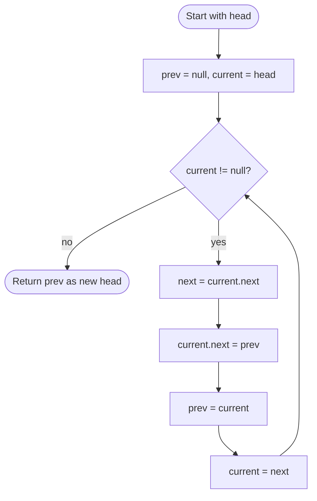

# Reverse Linked List

## Overview

A singly linked list is a chain of nodes where each node points to the next one. Reversing it means making every node point to its previous neighbour instead, so the old tail becomes the new head. This is done in one pass with three pointers: the node you are currently on, the one before it, and the one after it. The trick is to save the next node before you overwrite the current node's link, otherwise the rest of the list is lost.

## How it works

1. Set `prev = null` and `current = head`. `prev` will become the new head once the loop finishes.
2. While `current` is not null:
3. Save `next = current.next` so the remainder of the list is not lost.
4. Reverse the link: set `current.next = prev`.
5. Advance both pointers: `prev = current`, then `current = next`.
6. When `current` becomes null, every link has been flipped and `prev` points to the old tail. Return `prev` as the new head.

## Flow

## Complexity

| Case    | Time | Why                                                 |
| ------- | ---- | --------------------------------------------------- |
| Best    | O(n) | Every node must be visited once to flip its pointer  |
| Average | O(n) | No shortcut exists; each link is rewritten exactly once |
| Worst   | O(n) | Same single pass regardless of contents              |
| Space   | O(1) | Only three pointers; no new nodes are allocated      |

## When to use

- As a building block in list problems: checking palindromes, reversing in k-groups, reordering lists, adding numbers stored in reverse.
- Any time you need to iterate a singly linked list backwards without extra memory.
- Interview staple for pointer manipulation; the same three-pointer pattern appears in many in-place list transformations.

## Pitfalls

- Overwriting `current.next` before saving it drops the rest of the list and the loop ends early.
- Returning `head` (which is now the tail with `next == null`) instead of `prev` returns a one-element list.
- Advancing `current` before `prev` (or `prev` before saving `current`) misaligns the pointers and typically creates a cycle.
- The recursive version is elegant but uses O(n) stack space and can overflow on long lists.
- If the list is part of a larger structure, remember that the caller's `head` reference is now the tail.
