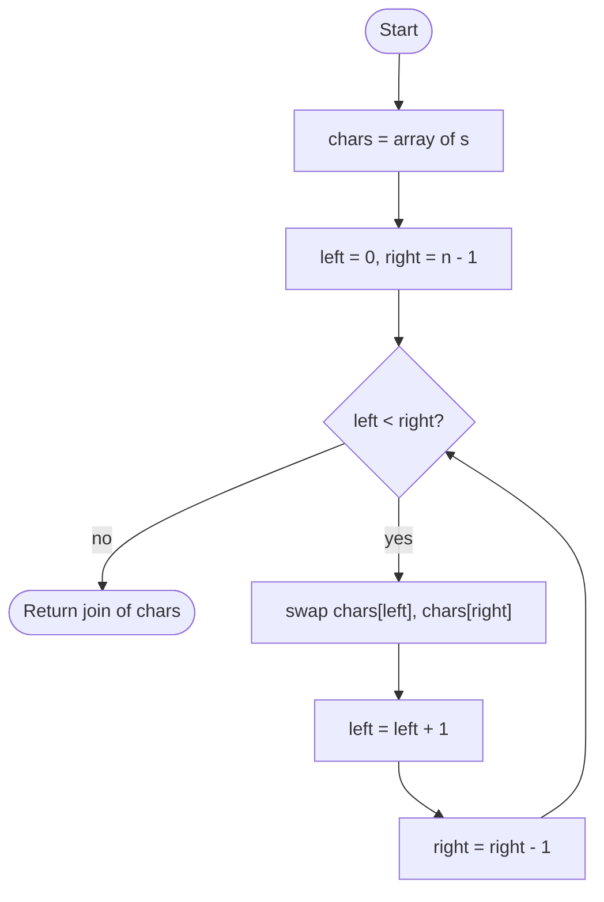

# Reverse String

## Overview

Reversing a string means producing the same characters in the opposite order. The two-pointer approach treats the characters as an array, puts one index at each end, swaps the pair, and moves both indices inward until they meet. Each character is moved exactly once. Because strings are immutable in many languages, the characters are first copied into a mutable array and joined back into a string at the end, which is why the space cost is linear even though the swapping itself is in place.

## How it works

1. Copy the string into a mutable array of characters (skip this step if the language has mutable strings or you are given a character array).
2. Set `left = 0` and `right = n - 1`.
3. While `left < right`, swap the characters at `left` and `right`.
4. Increment `left` and decrement `right`.
5. When the pointers meet or cross, the array is reversed. Join it back into a string and return it.

## Flow

## Complexity

| Case    | Time | Why                                                        |
| ------- | ---- | ---------------------------------------------------------- |
| Best    | O(n) | Every character must be read and written once               |
| Average | O(n) | n/2 swaps, each constant time                               |
| Worst   | O(n) | Same single pass regardless of content                      |
| Space   | O(n) | The mutable character array and the resulting new string    |

## When to use

- Reversing words, lines or tokens as part of larger text transformations (reverse each word, reverse word order).
- Checking palindromes when a copy is acceptable, or generating the reverse for LCS-based palindrome problems.
- Reversing digit sequences in arithmetic on big numbers stored as strings.
- As the general in-place array reversal primitive used by rotation algorithms (reverse the whole, then reverse each part).

## Pitfalls

- Looping while `left <= right` is harmless, but looping to `n` instead of `n / 2` reverses the string and then reverses it back.
- Concatenating characters one at a time onto a new string in a language with immutable strings is O(n²).
- Reversing bytes of a UTF-8 string, or UTF-16 code units of a string with surrogate pairs, corrupts multi-unit characters; reverse by code point or grapheme instead.
- Combining characters (accents stored as separate code points) also break when reversed naively.
- Forgetting to join the array back into a string returns the wrong type.
