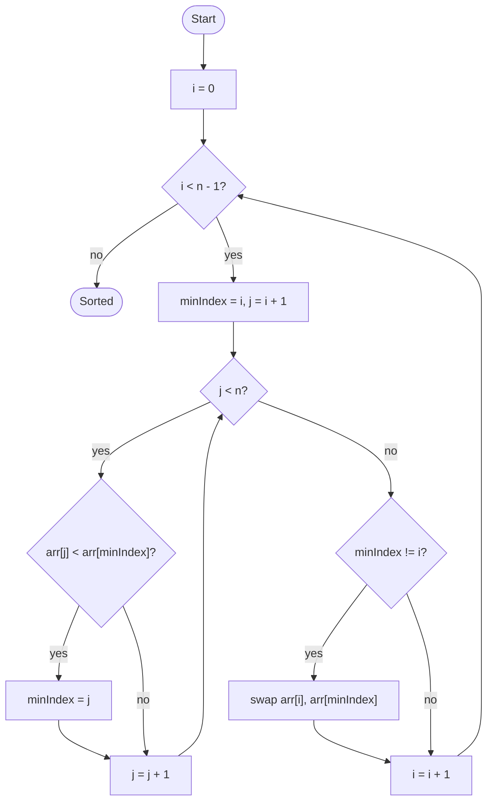

# Selection Sort

## Overview

Selection sort divides the array into a sorted prefix and an unsorted suffix. On every pass it scans the whole unsorted part to find its smallest element and swaps that element into the first unsorted position, growing the sorted prefix by one. It does the same amount of comparing no matter how the input is arranged, but it performs at most n - 1 swaps, which is the fewest of any simple sort.

## How it works

1. Treat position `i = 0` as the boundary: everything before it is sorted, everything from it onward is not.
2. Assume the element at `i` is the minimum of the unsorted part and remember its index as `minIndex`.
3. Walk `j` from `i + 1` to the end. Whenever `arr[j]` is smaller than `arr[minIndex]`, set `minIndex = j`.
4. After the scan, swap `arr[i]` with `arr[minIndex]` (if they differ). The smallest unsorted element is now locked into place.
5. Advance `i` by one and repeat from step 2 until `i` reaches `n - 1`. The last element is automatically in place.

## Flow

## Complexity

| Case    | Time  | Why                                                        |
| ------- | ----- | ---------------------------------------------------------- |
| Best    | O(n²) | The inner scan always runs fully, even on sorted input      |
| Average | O(n²) | About n²/2 comparisons regardless of order                  |
| Worst   | O(n²) | Same comparison count; the input order only changes swaps   |
| Space   | O(1)  | Sorts in place with a single index and a swap temporary     |

## When to use

- When writes are far more expensive than reads (flash memory, for example), since it never performs more than n - 1 swaps.
- Tiny arrays where the simplicity of the code is worth more than speed.
- Teaching the "find the minimum, put it in place" invariant that heap sort later speeds up with a heap.

## Pitfalls

- Starting the inner scan at `i` instead of `i + 1` is harmless but wasteful; starting at `i + 2` skips an element.
- Swapping inside the inner loop whenever a smaller element is seen turns the algorithm into a slower, swap-heavy variant.
- Selection sort is not stable: swapping the minimum into place can jump it over equal elements, changing their relative order.
- There is no early exit. Unlike bubble or insertion sort it stays quadratic on already sorted input.
