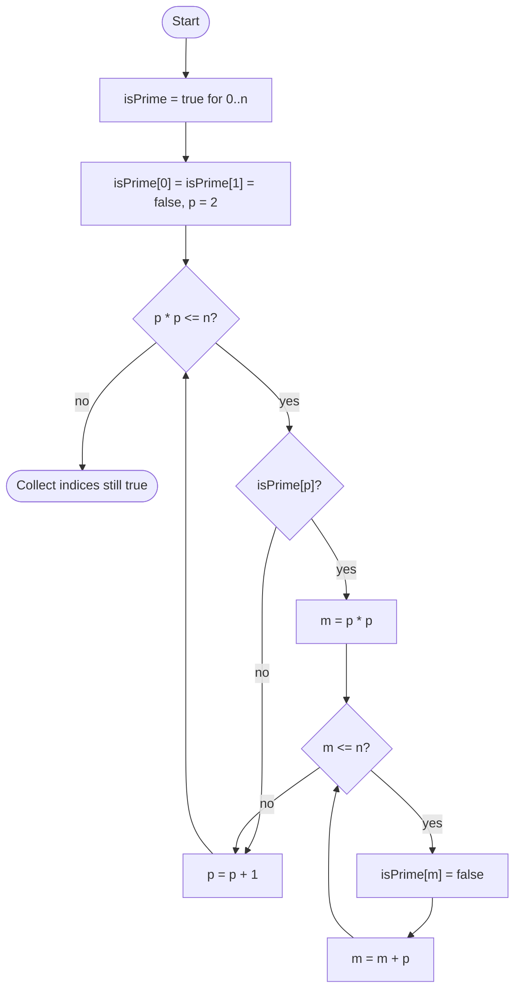

# Sieve of Eratosthenes

## Overview

The sieve finds every prime up to a limit n without doing a single division. Start by assuming every number from 2 upward is prime. Then take the smallest number still marked prime, which really is prime, and cross off all of its multiples. Move to the next unmarked number and repeat. Any composite number has a prime factor no larger than its square root, so it will have been crossed off by the time you reach it, and you can stop sieving once the current prime exceeds the square root of n.

## How it works

1. Create a boolean array `isPrime` of size `n + 1`, all set to true, then mark 0 and 1 as not prime.
2. Set `p = 2`.
3. While `p * p <= n`: if `isPrime[p]` is still true, mark every multiple of `p` starting from `p * p` (that is, `p*p`, `p*p + p`, `p*p + 2p`, ...) as not prime.
4. Increment `p` and repeat step 3.
5. Every index that is still marked true is prime. Collect them into a list.

## Flow

## Complexity

| Case    | Time           | Why                                                               |
| ------- | -------------- | ----------------------------------------------------------------- |
| Best    | O(n log log n) | Sum of n/p over primes p is n log log n by Mertens' theorem         |
| Average | O(n log log n) | The work depends only on n, not on any input arrangement           |
| Worst   | O(n log log n) | Same bound; the sieve always does the same marking                 |
| Space   | O(n)           | One boolean per number up to n                                     |

## When to use

- Generating all primes up to a few hundred million; it is far faster than testing each number individually.
- Precomputing a prime table for problems that make many primality queries.
- Variants compute the smallest prime factor of every number, enabling fast factorisation of many numbers.
- Counting primes or computing number-theoretic functions (Euler's totient, Mobius) in bulk.

## Pitfalls

- Starting the crossing-off at `2p` instead of `p * p` is correct but does redundant work; smaller multiples were already marked by smaller primes.
- Looping `p` up to `n` instead of `sqrt(n)` is correct but wastes time; computing `p * p` can overflow for large n in fixed-width integers, so compare `p <= n / p` instead.
- Forgetting to mark 0 and 1 as non-prime includes them in the output.
- Allocating the array of size `n` rather than `n + 1` drops the limit itself.
- For very large n the memory becomes the bottleneck; a segmented sieve processes the range in cache-sized chunks.
