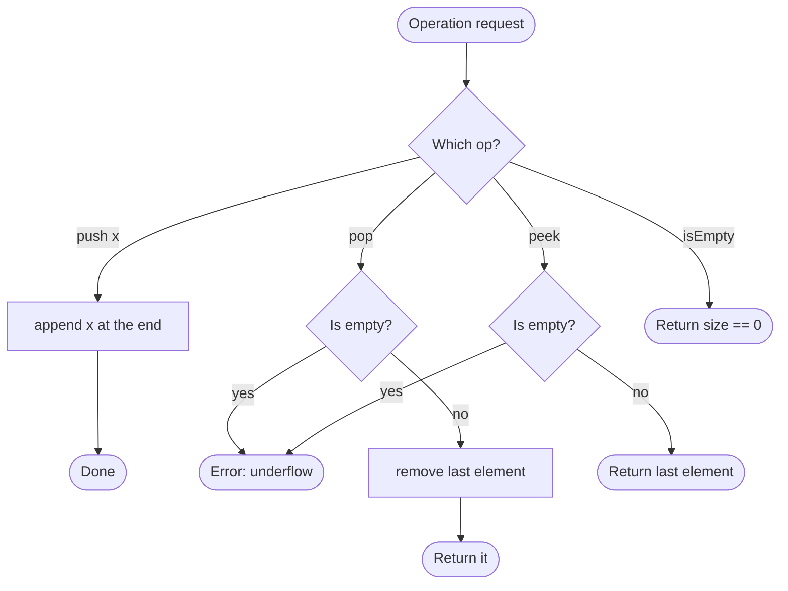

# Stack

## Overview

A stack is a collection where the most recently added element is the first one removed, like a stack of plates. It exposes three core operations: push adds an element on top, pop removes and returns the top element, and peek returns the top without removing it. Because every operation touches only the top, each runs in constant time. The simplest implementation stores the elements in a dynamic array and treats its last slot as the top.

## How it works

1. Keep a growable array (or a linked list) and treat its end as the top of the stack.
2. Push: append the new element at the end. Amortised constant time, since the array occasionally doubles in size.
3. Pop: if the stack is empty, signal an error (or return a sentinel). Otherwise remove the last element and return it.
4. Peek: if the stack is empty, signal an error. Otherwise return the last element without removing it.
5. isEmpty / size: report whether the length is zero, or the length itself.

## Flow

## Complexity

| Case    | Time | Why                                                             |
| ------- | ---- | --------------------------------------------------------------- |
| Best    | O(1) | Push, pop and peek touch only the top element                    |
| Average | O(1) | Array growth is amortised across many pushes                     |
| Worst   | O(1) | Amortised; a single resize is O(n) but happens rarely            |
| Space   | O(n) | Stores every element currently pushed                            |

## When to use

- Tracking nested structure: matching brackets, parsing expressions, validating HTML tags.
- Undo/redo histories and browser back navigation, where the latest action is undone first.
- Converting recursion into iteration: an explicit stack replaces the call stack in iterative DFS or tree traversals.
- Evaluating postfix (reverse Polish) expressions and implementing the call stack of an interpreter.
- Monotonic stack techniques for "next greater element" and histogram problems.

## Pitfalls

- Popping or peeking an empty stack must be handled explicitly; silently returning null or undefined hides bugs.
- Implementing the top at the front of an array makes push and pop O(n) because every element shifts.
- Using a stack when FIFO order is needed (a queue) reverses the processing order.
- Unbounded stacks can grow without limit; in memory-constrained contexts enforce a capacity or watch for runaway recursion.
