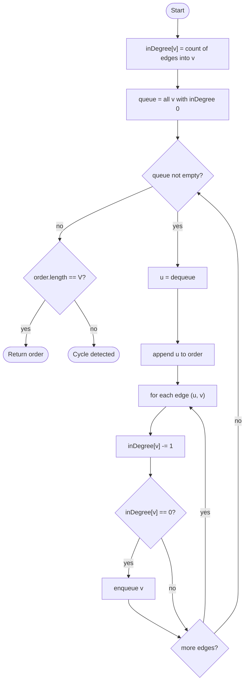

# Topological Sort (Kahn)

## Overview

A topological order of a directed acyclic graph lists the vertices so that every edge points from an earlier vertex to a later one. If edges mean "must happen before", the order is a valid schedule. Kahn's algorithm builds it by repeatedly removing vertices that have no incoming edges: such a vertex has no prerequisites left, so it can go next. Removing it decrements the in-degree of its successors, possibly freeing them. If the algorithm finishes without emitting every vertex, the leftovers all sit on a cycle, so the same procedure doubles as a cycle detector.

## How it works

1. Compute `inDegree[v]`, the number of incoming edges, for every vertex by scanning the adjacency list once.
2. Put every vertex with in-degree zero into a queue. These have no prerequisites.
3. While the queue is not empty, dequeue a vertex `u` and append it to the output order.
4. For each edge `u -> v`, decrement `inDegree[v]`. If it drops to zero, all of `v`'s prerequisites are done; enqueue `v`.
5. When the queue is empty, compare the output length with the vertex count. If they are equal the output is a valid topological order; if not, the graph contains a cycle and no order exists.

## Flow

## Complexity

| Case    | Time     | Why                                                               |
| ------- | -------- | ----------------------------------------------------------------- |
| Best    | O(V + E) | One pass to count in-degrees, then each vertex and edge once more  |
| Average | O(V + E) | The order vertices are freed does not change the total work        |
| Worst   | O(V + E) | Same; a cycle just means the queue empties early                   |
| Space   | O(V)     | The in-degree array, the queue and the output list                 |

## When to use

- Scheduling tasks with dependencies: build systems, package managers, course prerequisites, CI pipelines.
- Resolving the evaluation order of spreadsheet cells or dataflow graphs.
- Detecting cycles in a directed graph as a by-product.
- Dynamic programming over a DAG, where states must be processed after all their predecessors (longest path in a DAG, counting paths).
- When you need an order with a specific tie-break (lexicographically smallest), swap the queue for a min-heap.

## Pitfalls

- Forgetting the final length check silently returns a partial order when the graph has a cycle.
- Decrementing in-degree and enqueuing a vertex every time it is touched, instead of only when the count hits zero, emits vertices before their prerequisites.
- Building in-degrees from the wrong direction (counting outgoing edges) produces a reversed or invalid order.
- Vertices with no edges at all must still be included; they are in-degree zero from the start.
- Topological orders are not unique; tests that compare against one fixed answer are brittle. Verify the order by checking every edge instead.
- Mutating the graph's adjacency lists to "remove" edges is unnecessary and slow; the in-degree array is the only state that needs updating.
