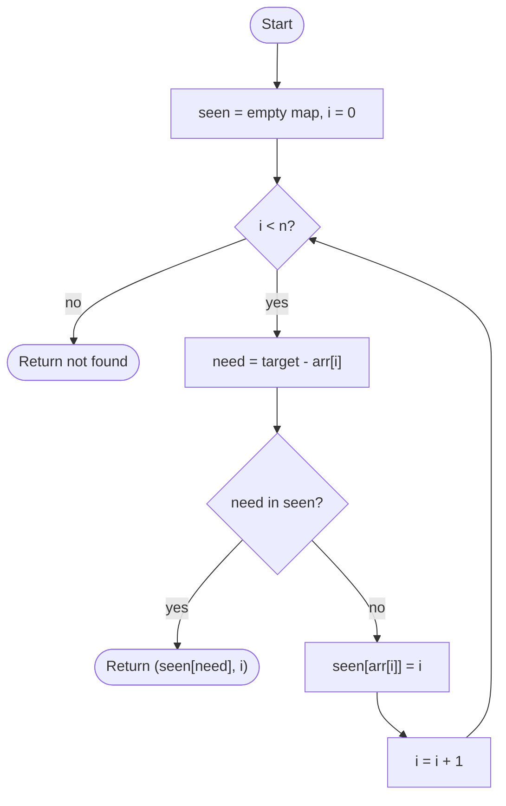

# Two Sum

## Overview

Given an array of numbers and a target, find two distinct indices whose values add up to the target. Checking every pair is quadratic. The hash map approach makes a single pass: for each element, compute the complement `target - value` and ask whether it has already been seen. If so, the pair is found; if not, record the current value and its index and keep going. Each lookup and insert is constant time on average, so the whole search is linear.

## How it works

1. Create an empty hash map from value to index.
2. For each index `i` with value `x` in the array:
3. Compute `need = target - x`.
4. If `need` is already a key in the map, the element at `map[need]` and the current element sum to the target; return the pair `(map[need], i)`.
5. Otherwise store `map[x] = i` and continue. Inserting after the lookup guarantees the same index is never paired with itself.
6. If the loop ends without a match, no such pair exists; return an empty result or `(-1, -1)`.

## Flow

## Complexity

| Case    | Time | Why                                                        |
| ------- | ---- | ---------------------------------------------------------- |
| Best    | O(1) | The first two elements form the pair                        |
| Average | O(n) | One hash lookup and insert per element                      |
| Worst   | O(n) | No pair exists, so the full array is scanned                |
| Space   | O(n) | The map may hold every element before a match appears       |

## When to use

- Finding a pair with a given sum, difference or product in unsorted data in one pass.
- As the inner step of three-sum and k-sum problems after fixing the other elements.
- Streaming scenarios where elements arrive one at a time and a matching partner must be reported immediately.
- Whenever a "have I seen the complement" question can be answered with a hash lookup; the same pattern solves subarray-sum-equals-k with prefix sums.

## Pitfalls

- Inserting the current element before checking for its complement lets an element pair with itself when `x * 2 == target`.
- Prefilling the map with every element and then scanning has the same self-pairing bug unless indices are compared explicitly.
- With duplicate values the map keeps only one index per value; this is fine for finding one pair, but problems that ask for all pairs need a list of indices per value.
- Floating-point values make exact complement lookups unreliable; use integers or a tolerance.
- The sorted two-pointer alternative is O(n log n) and loses the original indices unless they are carried along.
