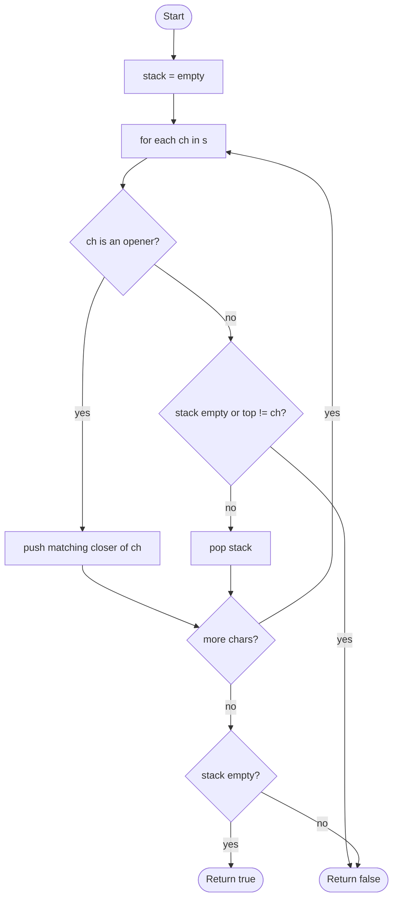

# Valid Parentheses

## Overview

A string of brackets is valid when every opening bracket is closed by the matching type and brackets close in the reverse order they were opened, so "([])" is valid but "([)]" is not. A stack models this exactly. Each opening bracket pushes the closer it expects; each closing bracket must equal the closer on top of the stack, which is then popped. If a closer arrives with an empty stack or the wrong expected closer, the string is invalid. At the end, any unclosed openers left on the stack also make it invalid.

## How it works

1. Build a map from each opening bracket to its closing partner: `(` to `)`, `[` to `]`, `{` to `}`.
2. Create an empty stack.
3. For each character `ch` in the string:
4. If `ch` is an opening bracket, push its expected closer onto the stack.
5. Otherwise `ch` is a closing bracket: if the stack is empty, or the top of the stack is not `ch`, return false. Else pop the stack.
6. After the loop, return true only if the stack is empty; leftovers mean some bracket was never closed.

## Flow

## Complexity

| Case    | Time | Why                                                           |
| ------- | ---- | ------------------------------------------------------------- |
| Best    | O(n) | Every character is read once (an early mismatch is rare)       |
| Average | O(n) | Each character costs one push or one pop                       |
| Worst   | O(n) | A valid string is scanned fully with n/2 pushes and pops       |
| Space   | O(n) | All-openers input keeps n entries on the stack                 |

## When to use

- Validating brackets in source code, JSON, or mathematical expressions before parsing.
- Editor features such as bracket matching and auto-closing.
- As the foundation for expression parsing and evaluating nested structures (HTML tags, XML, s-expressions).
- Problems about minimum insertions or removals to balance a string, which track the same stack or a counter.

## Pitfalls

- Using a single counter instead of a stack cannot tell "([)]" from "([])"; a counter works only when there is one bracket type.
- Forgetting the final empty-stack check accepts strings like "((" that never close.
- Popping without an empty check on input like ")" throws or reads garbage.
- Pushing the opener and comparing against a reverse map is equivalent, but mixing the two conventions compares an opener against a closer and rejects everything.
- Odd-length strings can never be valid; an up-front check is a cheap shortcut, not a replacement for the stack logic.
- Non-bracket characters must be either skipped deliberately or rejected, depending on the specification.
